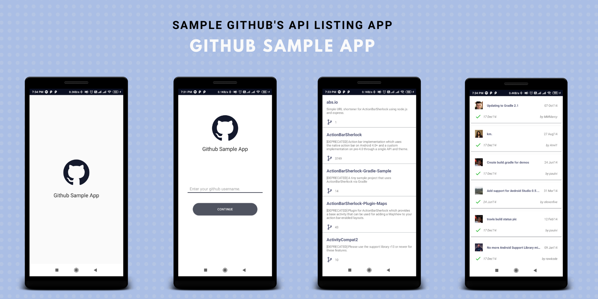

<p align="center">
 <center></a></center>
</p>

# Github Sample Application
[](https://www.android.com)
[](LICENSE)


This is a sample application 📱 built to demonstrate use of *Clean Architecture* tools. Dedicated to all Android Developers with ❤️.

***You can Install and test latest app from below 👇***

[](https://github.com/happysingh23828/Github-API-s-Sample-Android-app/raw/master/files/github_sample_app_happysingh23828.apk)

## - About
It simply loads repos and pull request list from [GITHUB-API](https://developer.github.com/v3)
- Modular approach followed
- It is heavily implemented by following standard clean architecture principle.
- Dependencies injection using dagger 2
- [S.O.L.I.D](https://en.wikipedia.org/wiki/SOLID) principle followed for more understandable, flexible and maintainable.

### - Disclaimer
Note: The use of clean architecture may seem over-complicated for this sample project. However, this allows us to keep the amount of boilerplate code to a minimum and also demonstrate the approach in a simpler form.
Clean Architecture will not be appropriate for every project, so it is down to you to decide whether or not it fits your needs 🙂

## - Built With 🛠
- [Kotlin](https://kotlinlang.org/) - First class and official programming language for Android development.
- [Rx-Java](https://github.com/ReactiveX/RxJava) - For composing asynchronous and event-based programs by using observable sequences.
- [Android Architecture Components](https://developer.android.com/topic/libraries/architecture) - Collection of libraries that help you design robust, testable, and maintainable apps.
  - [LiveData](https://developer.android.com/topic/libraries/architecture/livedata) - Data objects that notify views when the underlying database changes.
  - [ViewModel](https://developer.android.com/topic/libraries/architecture/viewmodel) - Stores UI-related data that isn't destroyed on UI changes.
- [Dagger 2](https://dagger.dev/) - Dependency Injection Framework
- [Retrofit](https://square.github.io/retrofit/) - A type-safe HTTP client for Android and Java.
- [OkHttp](http://square.github.io/okhttp/) - HTTP client that's efficient by default: HTTP/2 support allows all requests to the same host to share a socket
- [Picasso](https://github.com/square/picasso) - image loading framework for Android
- [Gson](https://github.com/google/gson) - used to convert Java Objects into their JSON representation and vice versa.

## - Clean Architecture

<center><p>- photo by: <a href="https://www.raywenderlich.com/3595916-clean-architecture-tutorial-for-android-getting-started">raywenderlich</a></p></center>

### What is clean architecture?
Architecture means the overall design of the project. It's the organization of the code into classes or files or components or modules. And it's how all these groups of code relate to each other. The architecture defines where the application performs its core functionality and how that functionality interacts with things like the database and the user interface.

### Why the cleaner approach?
1. Separation of code in different layers with assigned responsibilities making it easier for further modification.
2. High level of abstraction
3. Loose coupling between the code
4. Testing of code is painless
> Clean code always looks like it was written by someone who cares. - by Michael Feathers”

### Layers
- **Domain** - Would execute business logic which is independent of any layer and is just a pure kotlin/java package with no android specific dependency.
- **Data** - Would dispense the required data for the application to the domain layer by implementing interface exposed by the domain.
- **Presentation / framework** - Would include both domain and data layer and is android specific which executes the UI logic.

## - Modules of App
  ### App
  It uses the all the components and class releated to Android Framework. It gets the data from presentation layer and shows on UI.

  ### BuildSrc
  This module helps to list and manage all the dependencies of the app at one place. It has list of dependencies and versions of that dependencies.

  ### Data
  The Data layer is our access point to external data layers and is used to fetch data from multiple sources (the cache and remote in our case).

  ### Domain
  The domain layer responsibility is to simply contain the UseCase instance used to retrieve data from the Data layer and pass it onto the Presentation layer.

  ### Presentation
  This layer's responsibility is to handle the presentation of the User Interface, but at the same time knows nothing about the user interface itself. This layer has no dependence on the Android Framework, it is a pure Kotlin module. Each ViewModel class that is created implements the ViewModel class found within the Architecture components library. This ViewModel can then be used by the UI layer to communicate with UseCases and retrieve data.

  ### Remote
  The Remote layer handles all communications with remote sources, in our case it makes a simple API call using a Retrofit interface.

## - Current App's Architecture
This app uses [***MVVM (Model View View-Model)***](https://developer.android.com/jetpack/docs/guide#recommended-app-arch) architecture.

## If this project helps you in anyway, show your love :heart: by putting a :star: on this project :v:


## - Contributing

Please fork this repository and contribute back using
[pull requests](https://github.com/happysingh23828/Github-API-s-Sample-Android-app/pulls).

Any contributions, large or small, major features, bug fixes, are welcomed and appreciated
but will be thoroughly reviewed .

### - Contact - Let's become friend
- [Androchef Blog](https://androchef.com/)
- [Androchef Youtube](https://www.youtube.com/channel/UCILhpbLSFkGzsiCYAeR30DA)
- [Github](https://github.com/happysingh23828)
- [Linkedin](https://www.linkedin.com/in/happpysingh23828/)

## - License

```
MIT License

Copyright (c) 2020 Happy Singh

Permission is hereby granted, free of charge, to any person obtaining a copy
of this software and associated documentation files (the "Software"), to deal
in the Software without restriction, including without limitation the rights
to use, copy, modify, merge, publish, distribute, sublicense, and/or sell
copies of the Software, and to permit persons to whom the Software is
furnished to do so, subject to the following conditions:

The above copyright notice and this permission notice shall be included in all
copies or substantial portions of the Software.

THE SOFTWARE IS PROVIDED "AS IS", WITHOUT WARRANTY OF ANY KIND, EXPRESS OR
IMPLIED, INCLUDING BUT NOT LIMITED TO THE WARRANTIES OF MERCHANTABILITY,
FITNESS FOR A PARTICULAR PURPOSE AND NONINFRINGEMENT. IN NO EVENT SHALL THE
AUTHORS OR COPYRIGHT HOLDERS BE LIABLE FOR ANY CLAIM, DAMAGES OR OTHER
LIABILITY, WHETHER IN AN ACTION OF CONTRACT, TORT OR OTHERWISE, ARISING FROM,
OUT OF OR IN CONNECTION WITH THE SOFTWARE OR THE USE OR OTHER DEALINGS IN THE
SOFTWARE.```
